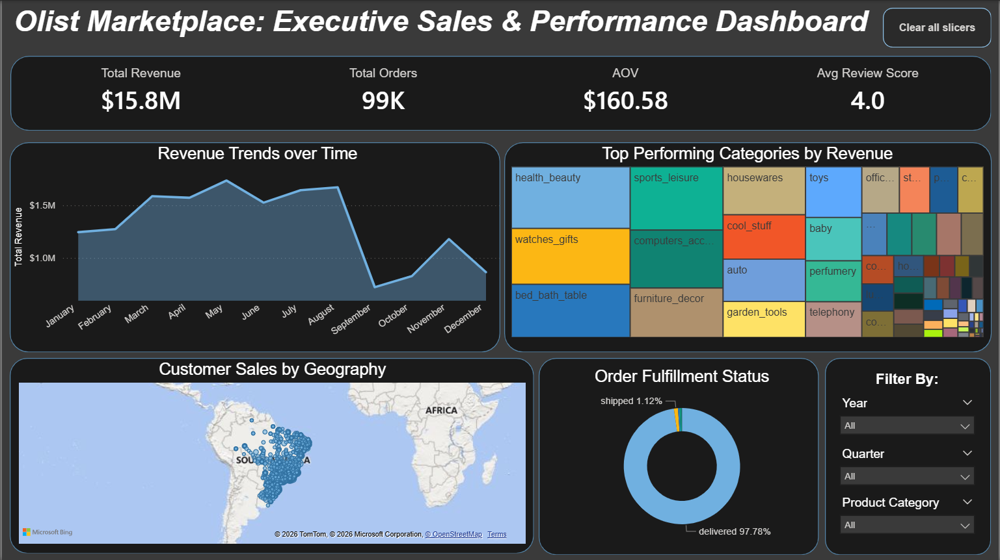
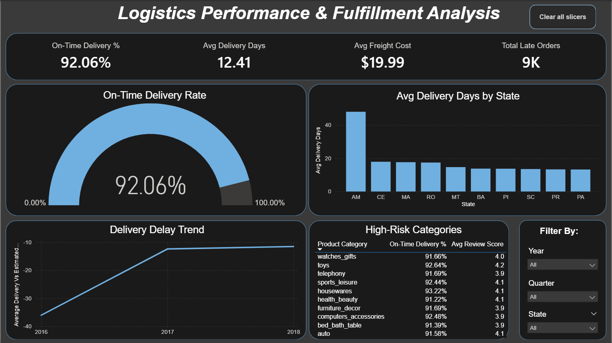
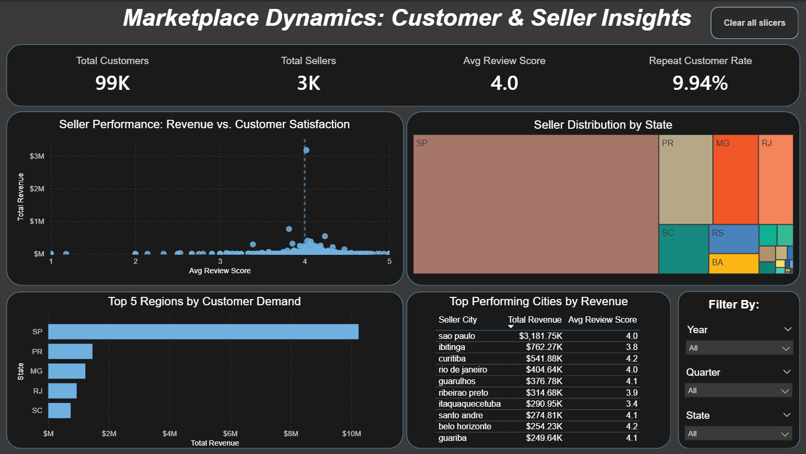

# Olist E-Commerce Data Warehouse & Analytics Project

## 📌 Project Overview
This project demonstrates the design and implementation of an end-to-end data analytics solution using a layered data architecture approach. The goal is to transform raw e-commerce data into a clean, business-ready analytical model that supports reporting and insights.

## 🎯 Objectives
* Build a structured data warehouse from raw CSV files.
* Apply data cleaning and transformation logic.
* Implement layered architecture (Bronze → Silver → Gold).
* Design a **Star Schema** for high-performance analytics.
* Develop an interactive Power BI dashboard for business storytelling.

## 🏗️ Architecture
The project follows a multi-layered architecture:
**Raw Data → Bronze Layer → Silver Layer → Gold Layer → Power BI Analytics**

## ⭐ Data Model (Gold Layer)
The analytical model is designed as a **Star Schema**, consisting of:
* **Fact Table**: `fact_order_items`
* **Dimension Tables**: `dim_customers`, `dim_products`, `dim_sellers`, `dim_date`

## 📊 BI & Visualization Layer (Power BI)
Following the completion of the Gold Layer in SQL Server, I developed an interactive Power BI dashboard to translate warehouse data into actionable business insights.

* **Key Technical Implementations:**
    * **Star Schema Architecture:** Utilized the Gold Layer to build clean, efficient relationships.
    * **Advanced UX/UI:** Implemented custom **Report Page Tooltips** to dynamically resolve state codes to full names, enhancing geographical data readability.
    * **Data Storytelling:** Identified a significant logistics bottleneck in the **Amazonas (AM)** region, providing a clear path for supply chain optimization.
    * **User Interactivity:** Added "Clear All Slicers" navigation buttons to improve the end-user experience and report accessibility.

### Dashboard Previews

## ⚙️ ETL Process
1. **Bronze Load**: Bulk insert from CSV files into SQL Server.
2. **Silver Load**: Data cleaning, type conversions, and business logic application.
3. **Gold Layer**: Analytical views created for reporting and BI consumption.

## 🛠️ Technologies Used
* SQL Server & T-SQL
* Power BI (DAX, Star Schema Modeling, Report Page Tooltips)
* GitHub (Version Control)

## 🚀 Future Improvements
* **Performance Optimization**: Implement indexing on key fact table columns for faster query execution.
* **Advanced Orchestration**: Integrate with Azure Data Factory for automated scheduling.
* **Predictive Analytics**: Incorporate forecasting models for revenue and logistics demand.

---
*[Download the Power BI report file here](https://github.com/Meenakshi0313/olist-ecommerce-analytics/blob/main/Power%20BI/Olist_E-commerce_Analytics_v1.0.pbix).*

**Author:** Meenakshi Singh | Data Analyst | SQL | Data Modeling | Business Intelligence

