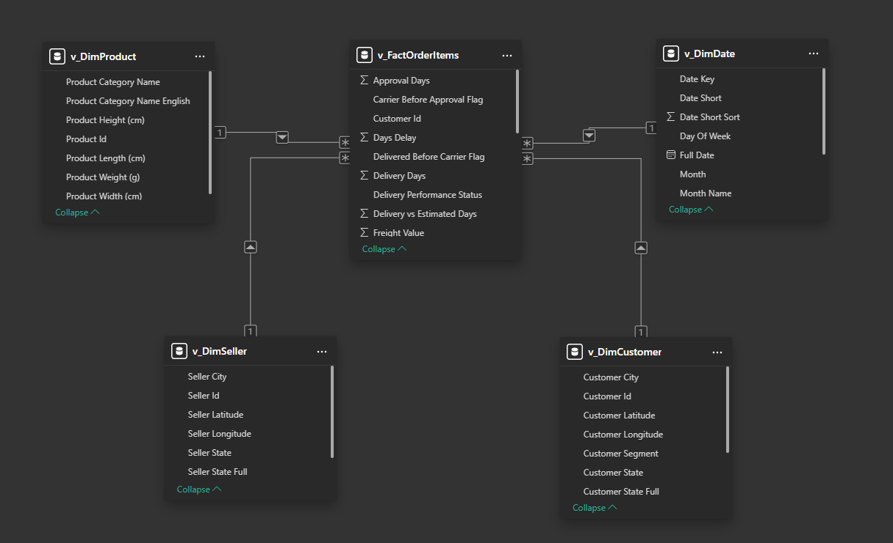
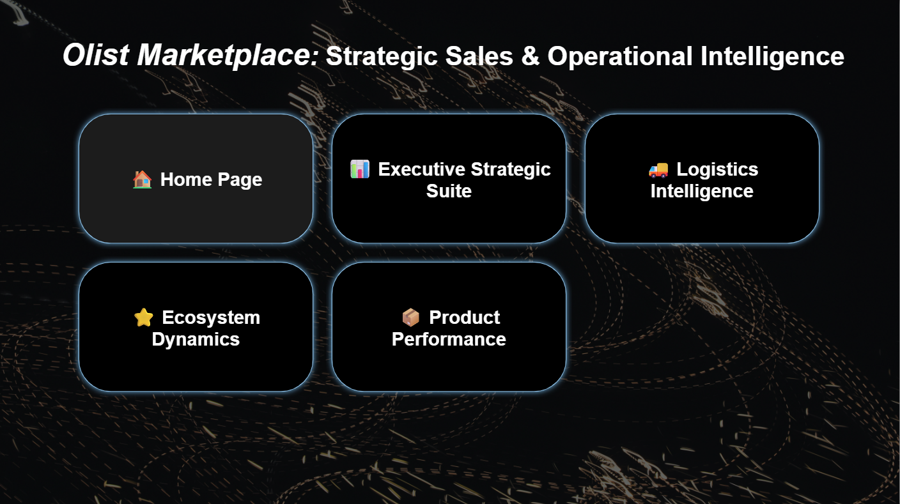
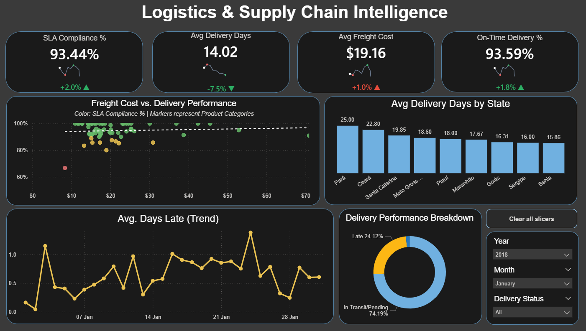
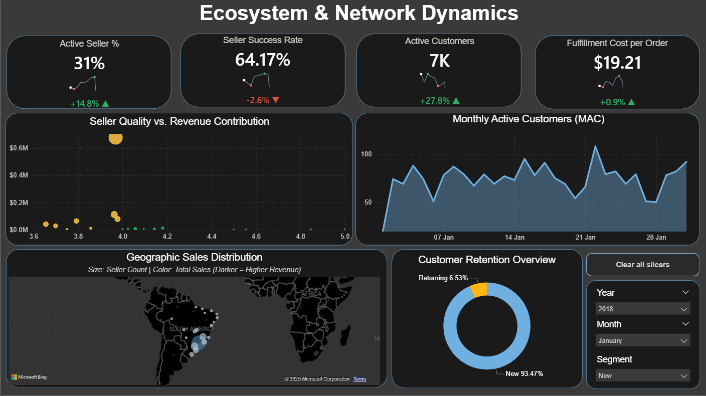
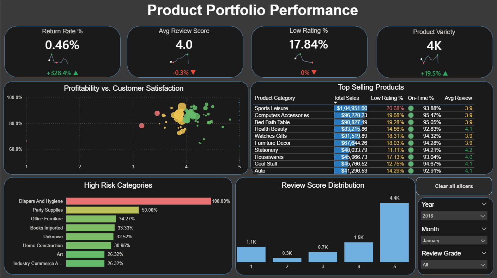

# 🚀 Olist Marketplace: Strategic Sales & Operational Intelligence Suite

## 📌 Executive Summary

This project delivers a high-fidelity, 5-page Business Intelligence suite designed to optimize the Olist E-Commerce marketplace. By transitioning from standard reporting to **Operational Intelligence**, this suite identifies logistics bottlenecks, seller quality outliers, and product portfolio risks through a modern, SaaS-style dark interface.

---

## 🛠️ Technical Architecture

### 1. Data Modeling (Star Schema)

The foundation of this suite is a high-performance **Star Schema** designed for scalability and DAX efficiency.

* **Fact Table:** `v_FactOrderItems` containing granular transactional metrics like Delivery Days, Freight Value, and Approval Days.
* **Dimension Tables:** Dedicated tables for Products (`v_DimProduct`), Dates (`v_DimDate`), Sellers (`v_DimSeller`), and Customers (`v_DimCustomer`).
* **Optimization:** Relationship cardinality is strictly 1:Many to ensure efficient calculation and filter propagation.

### 2. Advanced DAX & Analytical Logic

* **Monthly Active Customers (MAC):** A dynamic trend line used to measure platform stickiness and customer retention.
* **SLA Compliance:** Custom logic calculating the variance between estimated and actual delivery dates to track supply chain reliability.
* **Product Risk Logic:** A custom threshold-based alert system for **Low Rating %**:
    * **Critical (> 20%)**: Highlighted in Muted Coral.
    * **Warning (10-20%)**: Highlighted in Harvest Gold.
    * **Healthy (< 10%)**: Highlighted in Forest Mint.

---

## 🎨 UI/UX Design Philosophy

* **SaaS Interface:** Implemented a unified dark-themed design with customized navigation headers and synchronized slicers for a seamless user experience.
* **Semantic Color Palette:**
    * **Forest Mint (`#66BB6A`)**: Success / Target Achieved.
    * **Harvest Gold**: Caution / Mid-tier Performance.
    * **Muted Coral**: Critical Risk / Action Required.
* **Navigation Hub:** A centralized portal allowing stakeholders to move between different business domains without losing context.

---

## 📊 The Analytical Suite Breakdown

### 1. Home Page / Navigation Hub

The central entry point providing a high-level branding overview and intuitive access to all sub-intelligence modules.

### 2. Executive Strategic Suite

Focuses on "North Star" metrics including Total Revenue, Perfect Order Rate, and Revenue Distribution.

### 3. Logistics & Supply Chain Intelligence

Deep-dives into delivery performance, SLA Compliance %, and Average Delivery Days by state.

### 4. Ecosystem & Network Dynamics

Analyzes the health of the marketplace by mapping Seller quality vs. Revenue contribution.

### 5. Product Portfolio Performance

Identifies the "Stars" and "Risks" using Profitability vs. Satisfaction scatter charts.

---

## 📈 Key Insights & Business Value
* **Operational Efficiency:** Isolated high-cost logistics routes that were not meeting SLA standards.
* **Growth Strategy:** Identified the **Returning Customer** segment to help marketing teams focus on retention vs. acquisition.
* **Risk Mitigation:** Provided a "High Risk" list of product categories based on poor review scores, allowing for immediate quality control intervention.

---

## 📂 Repository Contents
* 📄 **[View Executive Performance Report (PDF)](Report_and_Dashboard/Olist_E-commerce_Analytics_Dashboard.pdf)**
* 📊 **[Download Power BI Dashboard (.pbix)](Report_and_Dashboard/Olist_E-commerce_Analytics_Dashboard.pbix)**
* 📂 **[View SQL Gold-Layer Transformation Scripts](SQL_Scripts/02_Gold_Reporting_Views.sql)**

---

**Author: Meenakshi Singh | Aspiring Data Analyst**

*Specializing in SQL, Data Modeling, and Business Intelligence.*
