## Olist E-Commerce: End-to-End Data Warehouse & BI Analytics

### 📌 Project Overview

This project transforms the Olist Brazilian E-Commerce dataset into a high-performance analytical tool. Moving beyond basic visualization, I engineered a multi-layered SQL data warehouse and a Star Schema model to uncover hidden logistical bottlenecks and marketplace growth dynamics from 2016 to 2018.

---

### 🚀 Quick Access

📊 View Executive Performance Report (PDF) (./Report_and_Dashboard/Olist_Full_Performance_Report_2016-2018.pbix.pdf)

🛠️ Download Power BI Dashboard (./Report_and_Dashboard/Olist_E-commerce_Analytics_Dashboard.pbix)

💾 View SQL Gold-Layer Transformation Scripts (./SQL_Scripts/gold/Olist_Gold_Layer_Views)

---

### 🏗️ Architecture & Data Engineering

The project utilizes a Medallion Architecture (Bronze → Silver → Gold) to ensure data integrity and query performance:

**Bronze**: Raw CSV ingestion into SQL Server.

**Silver**: Data cleaning, handling nulls in delivery dates, and standardizing category names.

**Gold (Business Layer)**: Created optimized SQL Views to serve as the source for Power BI, reducing report-level processing time.

---

### ⭐ Data Modeling (Star Schema)

The heart of this project is a high-performance Star Schema designed for scalability:

**Fact Table**: v_FactOrderItems (Centralized metrics for Revenue, Shipping, and Delivery).

**Dimension Tables**: v_DimCustomer, v_DimProduct, v_DimSeller, and a custom v_DimDate table.

**Key Logic**: Implemented 1-to-Many relationships to ensure filter integrity across all three dashboard pages.

---

### 📊 Business Intelligence & Advanced DAX

I implemented several advanced BI techniques to move the dashboard from "static charts" to a "diagnostic tool":

**Dynamic Reference Labels (YoY Analysis)**: Developed complex DAX measures using CALCULATE and ALL filters to show Year-over-Year growth percentages that remain accurate even when a specific year is filtered.

**Inverse KPI Polarity**: Customized conditional formatting for Logistics KPIs—where an increase in delivery days or freight cost is automatically flagged in Red, while a decrease is Green.

**Efficiency Scatter Analysis**: Replaced standard gauges with a Freight Cost vs. On-Time Delivery scatter plot to identify "The Danger Zone"—high-cost shipping lanes with low reliability.

---

### 📈 Marketplace Journey (2016 - 2018)

Click the sections below to view the historical progression of the marketplace.

  
📊 Executive Sales & Performance (2016-2018 Timeline)

   
  <h3>Full Marketplace Summary (All-Time)</h3>
  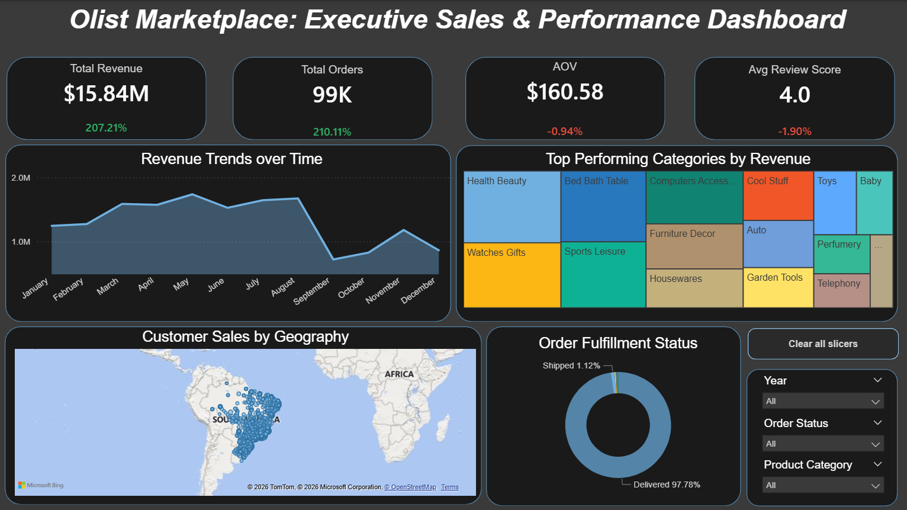
  

  <h3>Yearly Progression</h3>
  
<b>2016: The Launch Phase</b>

  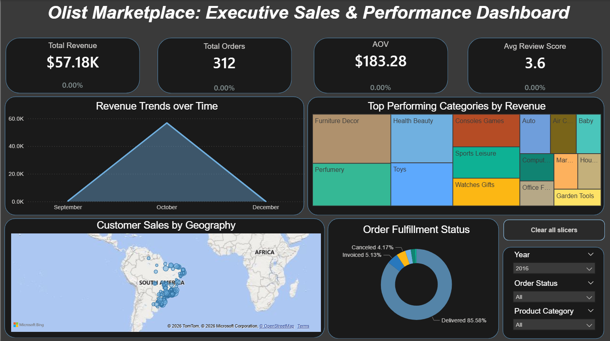
    
  
<b>2017: The Exponential Growth Year (+12,000% Revenue)</b>

  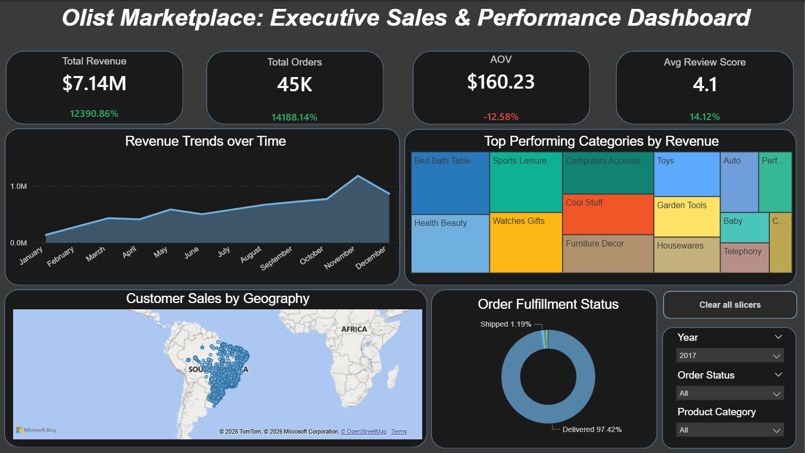
    
  
<b>2018: Market Maturity & Peak Performance</b>

  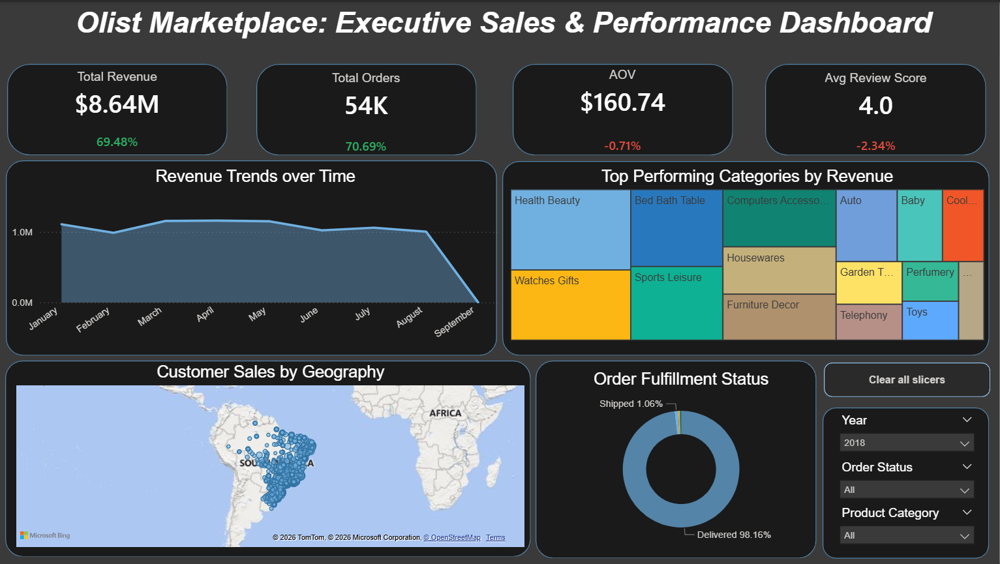

  

  
🚚 Logistics Performance & Fulfillment Analysis (2016-2018)

   
  <h3>Full Lifecycle Performance (All-Time)</h3>
  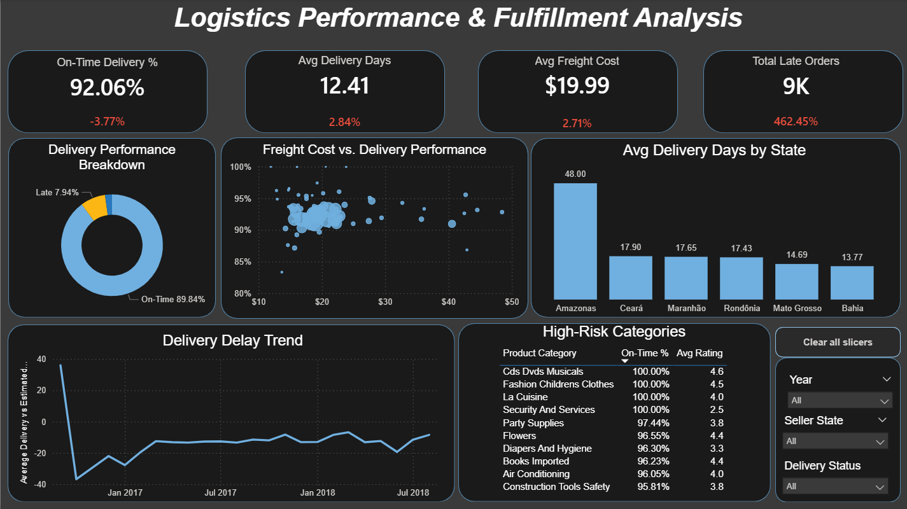
  

  <h3>Operational Evolution</h3>
  
  
<b>2016: The Efficiency Baseline</b>

  
<i>Insight: With low volume, the network achieved a 98.7% on-time rate with only 6 total late orders.</i>

  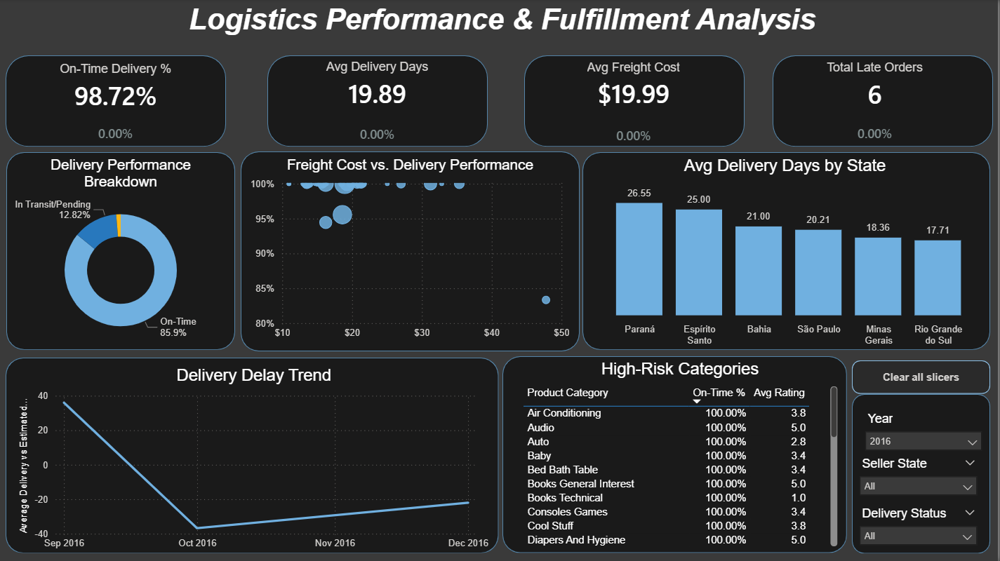
    
  
  
<b>2017: Scaling Challenges</b>

  
<i>Insight: As orders surged, the Amazonas (AM) region emerged as a major bottleneck with a 48-day average delivery time.</i>

  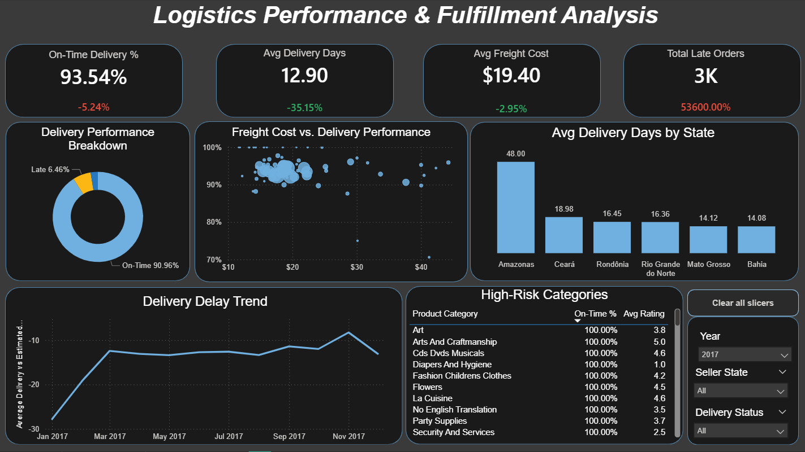
    
  
  
<b>2018: Diagnostic Optimization</b>

  
<i>Insight: Implemented the Freight Cost vs. Delivery Performance scatter plot to identify high-cost/low-reliability shipping lanes.</i>

  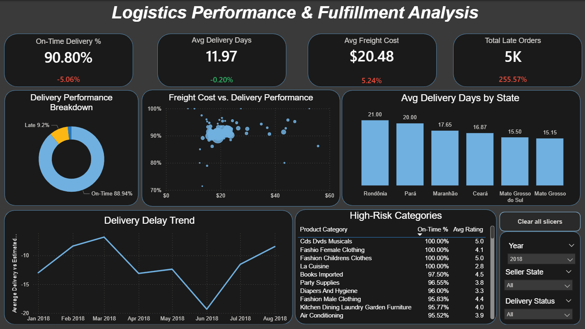

 

  
👥 Customer & Seller Insights (Marketplace Dynamics)

   
  <h3>Total Marketplace Footprint (All-Time)</h3>
  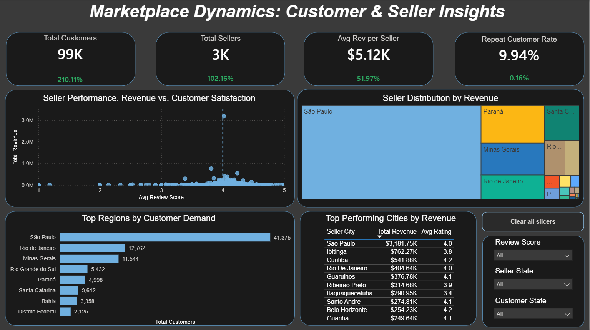
  

  <h3>Growth & Geography</h3>
  
  
<b>2016: Early Adopters</b>

  
<i>Focus: Initial seller distribution across the primary hubs of São Paulo and Rio de Janeiro.</i>

  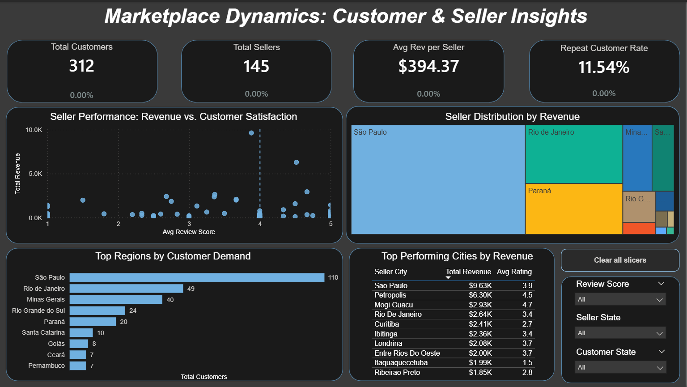
    
  
  
<b>2017: Rapid Expansion</b>

  
<i>Focus: Total customers increased by over 14,000%, testing the platform's ability to maintain a 4.0+ review score.</i>

  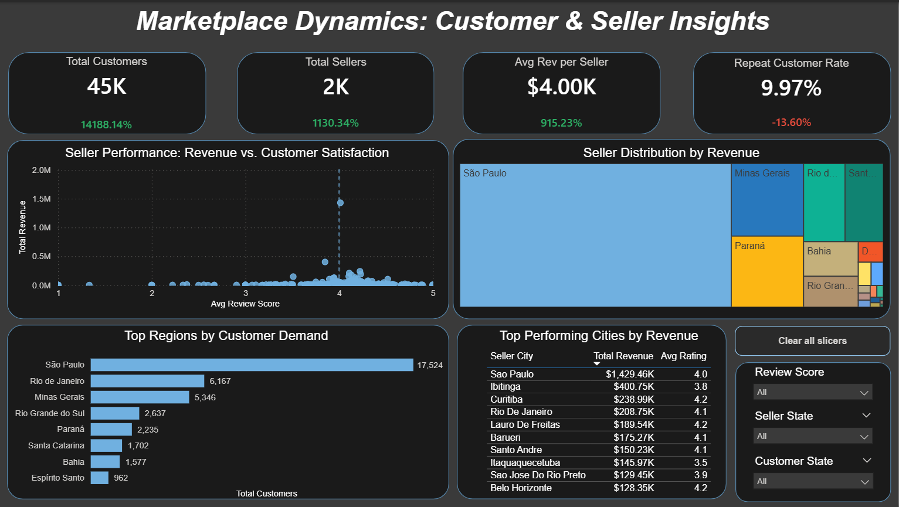
    
  
  
<b>2018: Established Marketplace</b>

  
<i>Focus: Analyzing the 9.9% repeat customer rate and the dominance of the São Paulo region in total revenue.</i>

  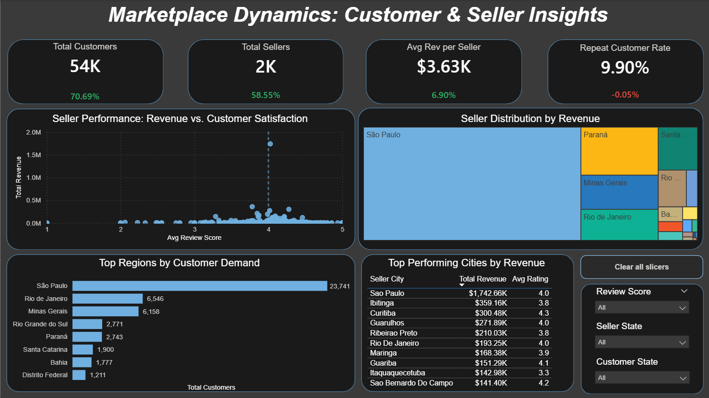

  

  
 🏠 Home Page 

   
  
  

---

### 💡 Key Insights & Recommendations

**Logistics Bottleneck**: The Amazonas (AM) region averages 48 days for delivery, nearly 4x the national average. Recommendation: Establish a local distribution hub or renegotiate carrier contracts for Northern Brazil.

**The "Sweet Spot"**: The scatter plot reveals that categories like "Bed Bath Table" have the highest volume and high costs; optimizing this single category’s logistics would have a massive impact on total margin.

**Scale Stability**: Despite a 14,000% increase in order volume from 2016 to 2017, the average review score stayed at 4.0, proving the marketplace's quality control is scalable.

---

### 🛠️ Tech Stack

**Database**: SQL Server (T-SQL)

**BI Tool**: Power BI (DAX, Power Query)

**Methodology**: Star Schema Modeling, Medallion Architecture, UI/UX Dashboard Design.

---

### Author: Meenakshi Singh | Aspiring Data Analyst

Specializing in SQL, Data Modeling, and Business Intelligence.

